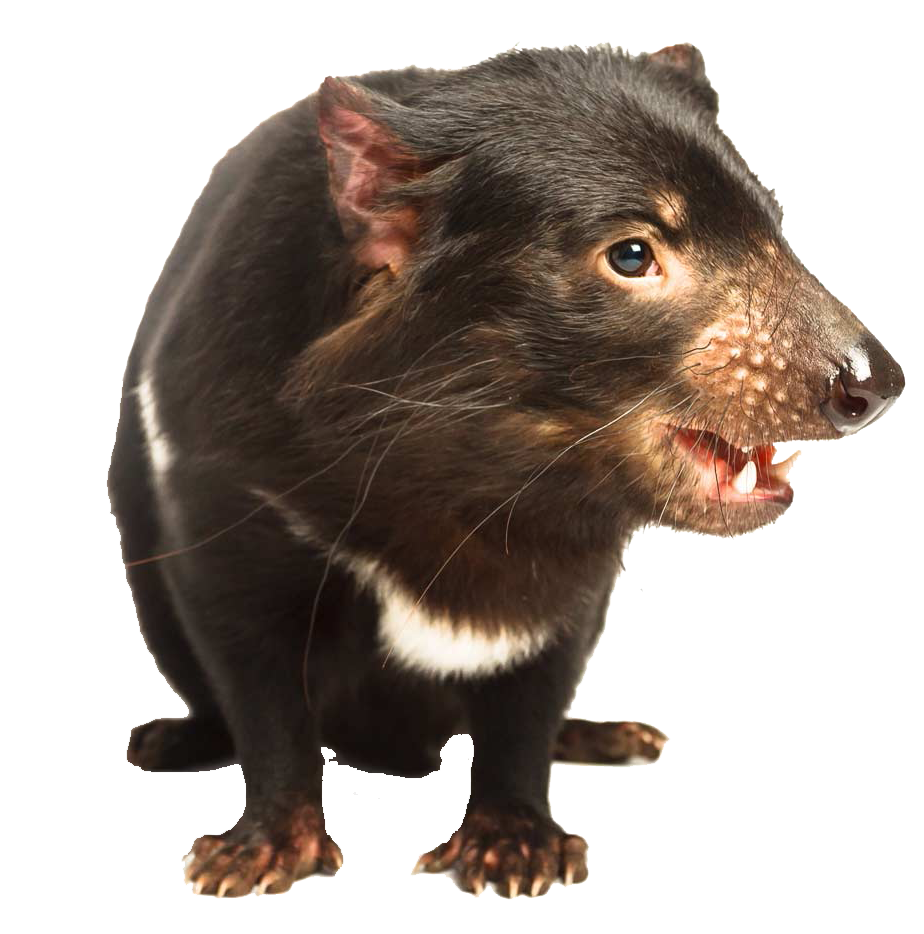

# devil population model

Population model for Tasmanian devils

Accompanies paper:

Bradshaw, CJA, BW Brook. 2005. <a href="http://dx.doi.org/10.1111/j.0906-7590.2005.04088.x">Disease and the devil: density-dependent epidemiological processes explain historical population fluctuations in the Tasmanian devil</a>. <em>Ecography</em> 28: 181-190

## Abstract
Australia’s last mega-carnivore marsupial, the Tasmanian devil <em>Sarcophilus harrisii</em>, Dasyuridae is endemic to the island state of Tasmania. The recent appearance and rapid spread of a debilitating and usually lethal, cancer-like disease has raised concerns regarding the species’ future. We used a demographic matrix modelling approach to evaluate the potential long-term implications of epidemics on this population. Both adult survival and temporally autocorrelated re-occurrence of disease were expressed as a function of female abundance. Large fluctuations in abundance resulted when disease outbreaks were conditioned to be density-dependent; however, this resulted in a low probability of quasi-extinction due to the dissipation of disease transmission at low densities. Epidemic stochasticity alone in an otherwise deterministic model resulted in major population cycles occurring every 77-146 yr, consistent with historical reports. Although epidemics in this species may not result in extinction directly, the contemporary presence of additional mortality sources during periods of low abundance may increase extinction risk.

## Matlab file
<code>devil_short.m</code>

## More information
See also a more recent version of the devil population model (R code) published in:
- Bradshaw, CJA, CN Johnson, J Llewelyn, V Weisbecker, G Strona, F Saltré. 2021. <a href="http://doi.org/10.7554/eLife.63870">Relative demographic susceptibility does not explain the extinction chronology of Sahul’s megafauna</a>. <em>eLife</em> 10: e63870. doi:10.7554/eLife.63870
- and its associated Github repository <a href="https://github.com/cjabradshaw/MegafaunaSusceptibility">here</a>

